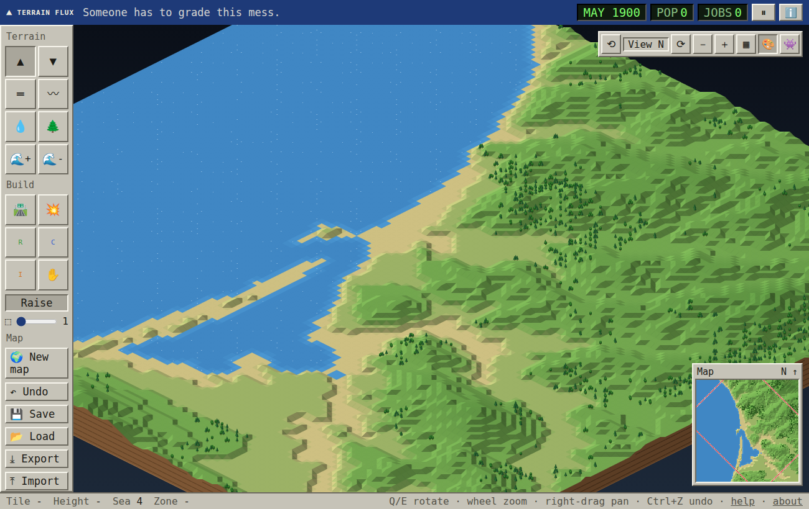
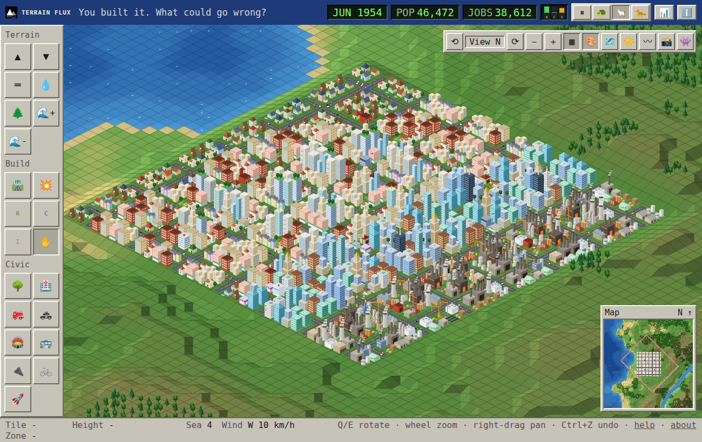

#  Terrain Flux

**Someone has to grade this mess.**

A SimCity 2000 style terrain and city sandbox with real California elevation baked in. Sculpt hills, flood the coast, zone a town, and watch it grow. Or watch it refuse to grow, if you built it somewhere ridiculous.

Part of [Lessel Geospatial Labs](https://lesselgeospatial.com).

## Play it

**[Launch Terrain Flux](https://lesselgeospatial.com)** <!-- swap in the live URL -->

It is one self-contained HTML file. No build step, no server, no install. Download `index.html` and open it, or host it anywhere static (GitHub Pages, Vercel, Cloudflare Pages).

New here? A one-minute guided tour runs on your first visit: load Morro Bay, build a starter town, add a fire station, light a fire upwind, make it rain, and read your report card. Replay it anytime from About or Help.

## What you can do

- 🏔️ **Sculpt terrain** with raise, lower, level, and smooth tools. Hillsides follow the cursor the way they did in 1993.
- 📍 **Start from a real place:** Morro Bay, Big Sur, Yosemite Valley, or San Francisco, built from 30 m SRTM elevation.
- 🌊 **Model sea level rise** on coastal real places, in meters, with NOAA 2022 scenario shortcuts and a tally of land, buildings, and people affected.
- 🌕 **Build on the Moon or Mars:** cratered ground, alien skies, ice instead of water, glass domes over every building, Moon fungus and Martian lichen instead of trees, and no fire, rain, biomes, or sea to raise.
- 🌍 **Paint biomes:** temperate forest, prairie, desert, chaparral, rainforest, bayou, mangrove, savanna, boreal, tundra, alpine, coral reef, and lava rock, each with its own ground, plants, and fire behavior. Or fill a whole map by climate.
- 🗺️ **Load your own DEM:** drop in any single-band GeoTIFF.
- 🌍 **Generate a map** with sliders for hills, water, and trees, plus optional coastline and river.
- 🌊 **Raise or lower the sea** and place water. It pools on flat ground and runs downhill as a stream, with waterfalls, on slopes.
- 🌧️ **Bring a storm** after a fire and watch debris flows run down the burned drainages, using a simplified USGS M1 likelihood model borrowed from [Scar Threshold](https://scar-threshold.pages.dev).
- ⏱️ **Pick a game speed:** pause, slow, normal, or fast.
- 📊 **Get a hazard report card:** A to F grades for wildfire, debris flow, earthquake, sea level rise, air quality, and services, by the share of residents exposed, with each one viewable on the map.
- 🗺️ **Map layers** for air pollution, fire, police, hospital, and transit coverage, wildfire risk, liquefaction, debris flow, sea level rise, and service gaps, so you can see where to build next. Every layer spotlights what it is about while the rest of the map dims: hazard layers light up the tiles at risk, and coverage layers draw a ring around each station's reach and light up the gaps outside them.
- 🌫️ **Watch the air:** factories, busy roads, and smoke pollute, the wind carries it downwind, and homes struggle to grow in dirty air.
- 🌎 **Trigger an earthquake:** pick a magnitude and an epicenter, then watch buildings collapse, slopes slide, waterfront ground liquefy, bridges drop, and fires break out.
- 🌋 **Raise a volcano:** the ground rumbles, a cone rises, it blasts lava and ash, and lava runs downhill, bury what it meets, start fires, cool into lava rock, and build new land at the sea.
- 🔥 **Start a wildfire** and watch it run downwind and uphill, leave a burn scar graded by severity, and heal over a few game years.
- 🏙️ **Zone and grow a city.** 9 building types with 6 styles each, 54 designs, all drawn in code, from A-frame cabins to a certain pyramid-shaped tower.
- 🏥 **Build civic buildings:** parks, hospitals, fire stations, police stations, stadiums, bus depots, EV charging, and bike share, 38 designs in all. Each one changes how the city around it grows.
- 🌬️ **Feel the wind:** gusts roll across the map and set the forests they pass swaying.
- 🌉 **Bridge the water:** drag a road across a river or bay and it becomes a bridge on pillars, up to 16 tiles long.
- 🚗 **Watch traffic** fill the roads near homes and jobs, while the road to nowhere stays empty.
- 🌙 **Day and night:** always day, always night, or a slow cycle (one day is five real minutes, so nothing flashes). Windows, streetlights, and headlights come on one by one at dusk.
- 〰️ **Contour lines** from the real elevation, with a sensible interval picked for each place and bold index contours.
- 🔄 **Rotate**, zoom, toggle a grid, switch between classic green and an elevation color ramp, or turn on chunky retro pixels.
- 🔗 **Share a link to exactly what you see:** terrain, water, roads, buildings, scars, and your view, usually in 2 to 4 KB.
- 📁 **Back up to a file** when you want a full copy, or for maps built from your own DEM.
- 📱 **Phone friendly:** the toolbar slides out as a drawer, and pinch to zoom and two-finger pan work on touch screens.
- 📸 **Take a snapshot** of the current view as a PNG, with an optional small credit.
- 💾 **Quick-save** to your browser.

## Controls

| Action | Input |
|---|---|
| Use the selected tool (starts on Pan) | Left click or drag |
| Pan | Right drag, middle drag, Alt + drag, arrows, or WASD |
| Zoom | Mouse wheel, `+` / `-`, or pinch |
| Rotate view | `Q` / `E` |
| Undo | `Ctrl` + `Z` |
| Grid / contours / tint / retro pixels | `G` / `C` / `T` / `P` |
| Day, cycle, night | `N` |
| Map layers | `L` |
| Snapshot | `K` |
| Pause / slow / normal / fast | `Space` / `1` / `2` / `3` |
| Cancel a road | `Esc` |

## How it works

**Terrain.** Heights live on the 129 by 129 corners of a 128 by 128 tile grid, and neighboring corners (diagonals included) can differ by one step at most. Every edit locks the corners you touched and clamps the rest of the map between the highest and lowest surfaces the rule allows, computed with two-pass chamfer envelopes. That keeps every slope legal without ever moving what you just edited.

**Real places.** Elevation is exported from Google Earth Engine in California Albers (EPSG:3310), cropped to the center square, box-averaged to 129 by 129, and stored in the HTML as 16-bit meters. Anything at or below 0 m becomes sea. Peaks steeper than the one-step rule allows are softened into slopes, which is why Yosemite's granite walls come out as stairs.

**Sea level rise.** Flooding uses the real SRTM meters stored with each place, not the game's blocky steps, and only spreads to land connected to the ocean (a breadth-first search from the sea), so low ground behind a ridge stays dry. It is a preview and destroys nothing. SRTM's vertical accuracy is a few meters, so small rises often fall below what the data can resolve.

**Contours.** Each tile runs marching squares on its four corners and draws the segments onto the tilted tile surface. Real places contour the true SRTM meters at an interval of about one twentieth of the relief (20 m for San Francisco, 50 m for Morro Bay, 100 m for Yosemite), with every fifth line bold.

**Biomes.** Each biome sets the ground colors, the plants drawn on a tile, and how fire behaves there: chaparral spreads fire 1.7 times faster and burns hotter, prairie and savanna run fast and light, deserts, wetlands, and tundra barely burn. Bayous and mangroves can grow in shallow water. The climate fill sorts tiles Whittaker-style by temperature and moisture: elevation cools things down, water nearby makes it wetter, and smooth noise varies both across the map. Climates: temperate, arid, tropical, cold, and mixed.

Biomes also change behavior. Gusts and fire spread are stronger in prairie, savanna, desert, tundra, and alpine, and weaker in rainforest and wetlands. Deserts get dust devils, and rainforests get passing showers that put out fires underneath them. Desert towns grow at about half speed unless water is within 4 tiles, and cold biomes grow slowly. Mangroves hold back 2 m of sea level rise for land within 3 tiles, and bayous and coral reefs hold back 1 m (on Morro Bay at +5 m, a mangrove belt cut flooded tiles from 81 to 50). Wetlands stop debris flows, and reefs give shops within 6 tiles a tourism boost.

**Volcanoes.** An eruption plays out in real time in stages: the ground shakes while a cone rises out of it, then a blast throws a lava fountain and an ash column, then five lava paths run steepest-way-down from the rim (nudged a little at random, and spreading a while across flat ground), then the vent smolders. Volcanoes can start on land or rise out of the sea floor as new islands. Lava buries whatever it reaches, ignites neighbors, glows for a few months while it cools into lava rock, and where it reaches shallow sea it builds new land.

**The Moon and Mars.** The World option under New map swaps in a cratered generator (bowls with raised rims, small craters more common than big ones), gray regolith with dark maria or rust-red ground with dark basalt, a starry black sky with Earth on the horizon or a butterscotch Martian sky, ice in place of water, and glass domes over buildings. Fire, rain, biomes, and sea level controls are switched off, the Moon has no wind, and Mars has dust devils everywhere. Planting trees gives pale fungus clusters on the Moon and, on Mars, the things that could plausibly survive there: lichen on rocks and greenhouse pods.

**Wildfire.** A tile-by-tile spread model. Each burning tile tries to ignite its neighbors with odds set by fuel (forest burns longest, grass fastest, buildings burn too), wind (exponential in the downwind component, boosted inside gusts), and slope (faster uphill). Roads, water, beaches, bare rock above 2,900 m, and fresh scars are firebreaks. Fire stations cut spread inside their reach and burn tiles out faster. Each burned tile records low, moderate, or high severity, which fades over five game years before the forest regrows. It is a game model, not a fire behavior model like FARSITE.

**Storms and debris flows.** Water is routed downhill tile to tile (D8), and the map is split into drainages that each drain about 40 tiles. Each drainage gets a likelihood from a simplified USGS M1 model (Staley et al. 2017), the same model behind [Scar Threshold](https://github.com/jerrod-lessel/scar-threshold):

`x = -3.63 + (0.41 X1 + 0.67 X2 + 0.70 X3) R`, `p = 1 / (1 + e^-x)`

X1 is the share of the drainage that is steep (23 degrees or more) and burned at moderate or high severity, X2 is the average burn severity standing in for dNBR, X3 is soil erodibility held at 0.25, and R is the peak 15-minute rainfall in mm. Classes match Scar Threshold: Low under 0.2, Moderate, High at 0.6 or above. Only drainages with at least 10% recently burned ground are assessed. When it rains, each drainage rolls against its likelihood, and a flow starts at the highest badly burned slope upstream, runs down the channel until the ground flattens, and drops a fan. Hazard fades as burn scars heal. It is a toy built on a real model's shape, not a forecast.

**Air pollution.** Heavy industry, factories, sheds, busy roads, and burning tiles emit pollution that spreads as a simple wind-driven plume: it widens as it travels downwind, fades with distance, and barely reaches upwind. Traffic is a short-range source; heavy industry plumes reach about 10 tiles. Bus depots take a quarter of the cars off nearby roads and cut traffic pollution by a third, EV charging cuts tailpipe pollution by 30%, bike share removes a fifth of trips, and park trees soak up a little. Homes in moderate air grow slower and cannot become towers; homes in unhealthy air stay small. A dense test downtown with no transit graded D on air (32% of homes exposed); adding one bus depot, two EV chargers, and two bike shares brought it to A with a larger population. In a test town, factories upwind of the homes held population to about 1,800, while the same factories downwind allowed about 12,100.

**Hazard report card.** Each category counts residents exposed: homes with at least 4 forest tiles within 3 tiles, with each fire station that reaches a home cutting its risk to 40% (wildfire), homes in Moderate or High debris flow drainages at 24 mm/hr, homes on liquefiable ground, homes underwater at +2 m (coastal real places), homes in moderate or worse air, and average coverage by fire, police, and hospitals. Exposure under 5% earns an A, then B under 15%, C under 30%, D under 50%, and F above. A small nod to tools like CalEnviroScreen that map burden against where people live.

**Earthquakes.** Shaking uses a Modified Mercalli style intensity that falls off with distance, `MMI = 1.68 + 1.2 M - 2.6 log10(R + 5)` with R in km, and low flat ground next to water shakes one step harder (liquefaction). Each tile then rolls for damage: buildings collapse above a type-specific intensity (towers and heavy industry first, houses last), roads crack, bridges drop a whole span, steep slopes away from the shore slide, and collapsed buildings can start fires that join the wildfire model. Rubble, landslide scars, and sand boils fade over a year and a half. It is a toy attenuation curve, not a ShakeMap.

**Share links.** A link stores the recipe for the starting map (a seed or a real place) plus only what changed since, packed into a byte array, compressed with deflate, and base64url encoded after the `#`. Opening it regenerates the base map and replays the changes, which reproduces the city exactly. Tree planting on real places is seeded so the base is identical every time.

**Growth.** Any zone next to a road can become a small building, so lone rural zones stay rural forever. Climbing higher takes a balanced, well-served city:

- **City-wide demand** (the R C I bars in the top bar): homes want about one job for every two residents, shops want customers, and industry wants workers plus some business from the shops. A brand new town starts with a little demand for everything. Zones with no demand stop growing, and badly oversupplied ones slowly empty out.
- **Level 2** needs neighbors, demand nearby, and fire or police coverage, and homes need air that isn't unhealthy.
- **Level 3** needs a dense neighborhood, strong demand, fire and police coverage, and for homes clean air, a hospital, and a park within 6 tiles.
- **Pace:** at Normal speed a zone reaches level 1 in about 20 seconds, level 2 in about a minute, and level 3 in about three minutes. Every tile has its own pace and the top level has extra randomness, so towers rise one at a time instead of all at once.

Hover any zone to see exactly what it is waiting for.

**Civic buildings.** Each one reaches a radius of tiles. Parks speed up nearby homes and count as a nicer neighborhood. Hospitals count as jobs for homes. Fire stations speed up factories. Police stations speed up everything, and towers need police coverage. Stadiums take a 2 by 2 lot, boost shops, and pull crowds onto the roads.

**Wind.** A slowly shifting wind spawns gusts just upwind of wherever you are looking, and they drift through. Only the screen area under each gust gets redrawn, so a calm forest costs nothing.

**Traffic.** Each road tile scores the development within 3 tiles, then spreads that score along the road network with a 28% falloff per tile. Cars, lit windows, and streetlights hide behind buildings and hills using two small depth buffers: one of building silhouettes, one of the terrain itself.

## Add your own place

1. Edit the place list in [`data/export_presets_gee.js`](data/export_presets_gee.js) (longitude, latitude, half-width in meters), run it in the [Earth Engine Code Editor](https://code.earthengine.google.com), and run the export tasks.
2. Open [`data/build_presets.ipynb`](data/build_presets.ipynb) in Google Colab, upload the GeoTIFFs, and run the cells.
3. Paste the printed `PRESETS` list over the one in `index.html`.

The notebook reproduces the shipped presets byte for byte, so you can rebuild them from scratch.

## Roadmap

- [x] Real place presets
- [x] About panel
- [x] Smoother traffic
- [x] Civic buildings: parks, hospitals, fire and police stations, stadiums, each with real effects
- [x] Wind gusts and swaying trees
- [x] Sea level rise scenarios in meters on real terrain
- [x] Contour line overlay
- [x] Wildfire
- [x] Post-fire debris flows (inspired by [Scar Threshold](https://github.com/jerrod-lessel/scar-threshold))
- [x] Game speeds
- [x] Bridges
- [x] Day and night cycle
- [x] Shareable map links
- [x] Hills that hide cars
- [x] Pinch to zoom on phones
- [x] Earthquakes
- [x] One link that shares the whole city
- [x] Air pollution
- [x] Hazard report card
- [x] Transit that cleans the air
- [x] Map layers for coverage and gaps
- [x] Guided tour
- [x] Snapshots
- [x] Mobile layout and a performance pass
- [x] More building styles
- [x] Demand bars and service requirements for growth
- [x] Biomes (phase 1: looks, plants, fire)
- [x] Biomes phase 2: local wind, dust devils, rainforest rain, coastal protection, growth effects
- [x] Coral reefs and volcanoes
- [x] Moon and Mars mode (reskin)
- [ ] Real Moon and Mars elevation presets

## Credits

- Elevation: [SRTM 30 m](https://developers.google.com/earth-engine/datasets/catalog/USGS_SRTMGL1_003), NASA and USGS, via Google Earth Engine
- GeoTIFF reading: [geotiff.js](https://github.com/geotiffjs/geotiff.js) (MIT)
- Fonts: [Press Start 2P](https://fonts.google.com/specimen/Press+Start+2P) and [VT323](https://fonts.google.com/specimen/VT323) (SIL Open Font License)
- Inspired by SimCity 2000 (Maxis, 1993). Every pixel here is drawn in code; no original game assets are used.

## Support

Terrain Flux is free. If it made you smile, you can [buy me a cup of tea on Ko-fi](https://ko-fi.com/jerrodlessel). ☕

## License

[MIT](LICENSE) © 2026 Jerrod Lessel
